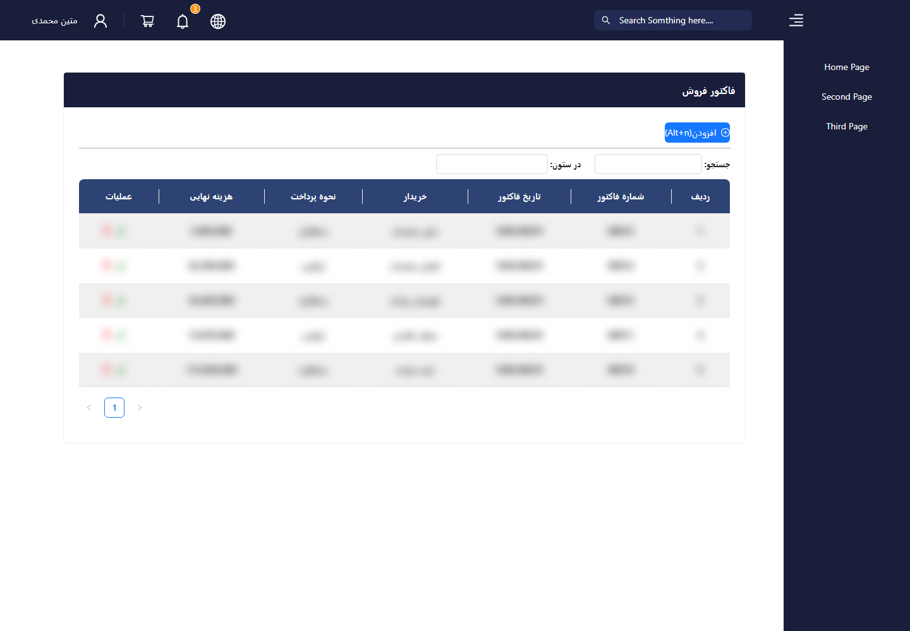
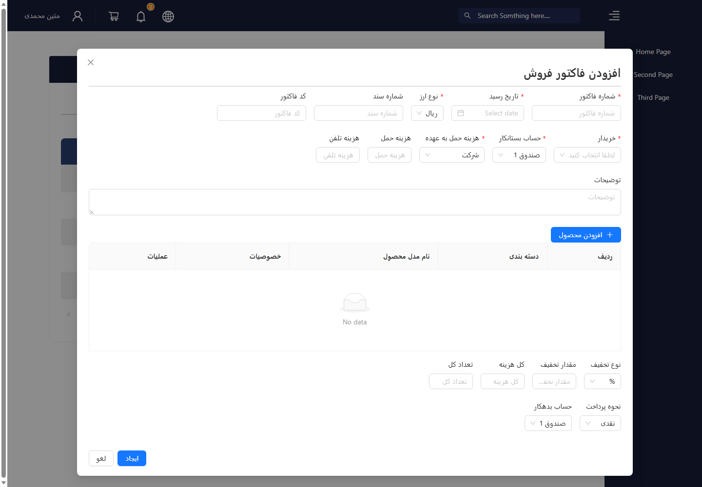
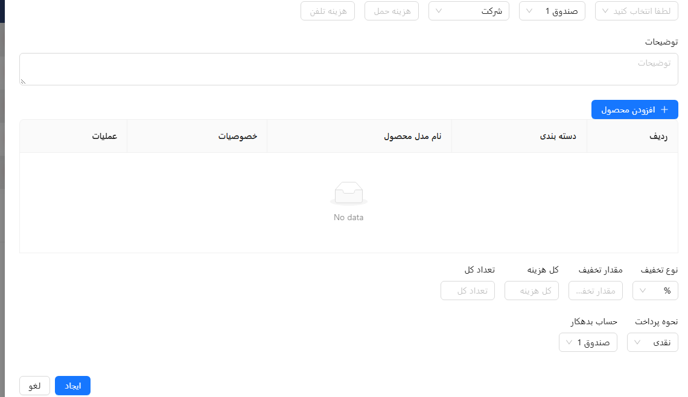

# Factor Form

**English** · [فارسی](#فارسی)

A React-based invoice and company receipt interface prototype. The project focuses on a structured, Persian-friendly business form with navigation, invoice fields, product rows, discounts, payment options, and a dashboard-style layout.

## Screenshots

**Invoice overview · نمای فهرست فاکتورها** (sample rows are blurred)

**Create an invoice · ثبت فاکتور**

**Invoice line items and payment · جزئیات کالا و پرداخت**

## Features

- Layout with navigation bar and sidebar
- Multiple routes for the home, second, and third pages
- Invoice number, date, currency, document, and code fields
- Buyer, account, shipping, telephone, and description fields
- Product table with edit and delete action placeholders
- Discount, total cost, quantity, and payment controls
- Persian labels and a business-oriented interface
- Ant Design components with custom styling

## Tech Stack

- React 18
- Vite
- React Router
- Ant Design
- Styled Components
- JavaScript (JSX)

## Getting Started

~~~bash
git clone https://github.com/MatinMuhammadi1381/Factor_Form.git
cd Factor_Form
npm ci
npm run dev
~~~

Open the local URL shown by Vite, usually http://localhost:5173.

On Windows, `INSTALL-DEPENDENCIES.bat` installs dependencies with `npm ci`.

## Available Scripts

~~~bash
npm run dev       # Start the development server
npm run build     # Create a production build
npm run preview   # Preview the production build
npm run lint      # Run ESLint
~~~

## Routes

| Route | Description |
| --- | --- |
| `/#/` | Home page |
| `/#/second` | Secondary page |
| `/#/Third` | Third page (case-sensitive) |

The app uses `HashRouter`, so routes follow the `#` in the browser URL.

## Project Structure

~~~text
src/
├── components/   # Navigation, invoice form, and invoice table
├── pages/        # Route-level pages
├── Layout.jsx    # Shared application layout
├── App.jsx       # Router configuration
└── main.jsx      # Application entry point
~~~

## Current Scope

This is currently a UI prototype. Invoice records are not persisted, the product table starts with an empty data source, and the edit/delete actions are placeholders for future business logic.

---

## فارسی

نمونهٔ رابط کاربری React برای فرم فاکتور و رسید شرکت، با چیدمان مناسب متن فارسی و اجزای Ant Design.

### امکانات رابط کاربری

- نوار پیمایش و سایدبار با مسیرهای صفحهٔ اصلی، دوم و سوم
- فیلدهای شماره و تاریخ فاکتور، خریدار، حساب، ارسال، توضیحات و پرداخت
- جدول کالا، تخفیف، تعداد و مبلغ کل؛ دکمه‌های ویرایش و حذف نمایشی هستند

### فناوری‌ها و راه‌اندازی

React 18، Vite، React Router، Ant Design، Styled Components و JavaScript (JSX). به Node.js و npm نیاز دارید:

~~~bash
git clone https://github.com/MatinMuhammadi1381/Factor_Form.git
cd Factor_Form
npm ci
npm run dev
~~~

در ویندوز `INSTALL-DEPENDENCIES.bat` را اجرا کنید. نشانی محلی معمولاً `http://localhost:5173` است. دستورهای build و lint عبارت‌اند از `npm run build` و `npm run lint`.

### محدوده

این پروژه نمونهٔ رابط کاربری است، نه سامانهٔ آمادهٔ حسابداری: اطلاعات فاکتور ذخیره نمی‌شود، جدول کالا دادهٔ اولیه ندارد و عملیات ویرایش/حذف فقط جای‌نگهدار هستند.